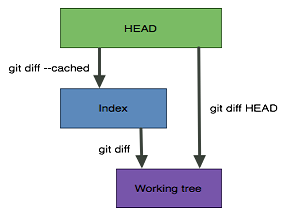

## 1. Git Terminology List ([terminology](#git-terminology))

[Clone](#clone) | [Fork](#fork) | [.gitignore](#gitignore) | [ HEAD](#HEAD)

---


## 2. Git Command List ([commands](#git-commands))

git [add](#git-add) | git [branch](#git-branch) | git [checkout](#git-checkout) | git [clean](#git-clean) | git [clone](#git-clone) | git [commit](#git-commit) |  git [commit --amend](#git-commit---amend) | git [config](#git-config) | git [diff](#git-diff) | git [fetch](#git-fetch) | git [init](#git-init) | git [log](#git-log)  | git [merge](#git-merge) | git [mergetool](#git-mergetool) | git [pull](#git-pull) | git [push](#git-push) | git [rebase](#git-rebase)  | git [reflog](#git-reflog) | git [remote](#git-remote) | git [reset](#git-reset) | git [show](#git-show) | git [status](#git-status) | git [subtree](#git-subtree) | git [upgrade on Windows](#upgrade-on-windows)

---

## 3. Git Examples

#### Push from local `feature` to remote `feature`

```bash
  git stash save 'message'         # stash local changes
  git pull origin master --rebase  # rebase feature to the origin master
  # `pop` to remove from stash and reapply, `apply` to keep them in your stash and reapply
  git stash pop/apply              # merge local changes into the latest code

  git add <file/directory>         # stage
  git commit -m 'message'
  git push --force-with-lease      # push to feature and check for changes, in case you share the branch
```

#### Get familiar with the workflow (Not the best way to push)

```bash
# 1. Get an idea of what has been changed at remote
git fetch                                         # update remote-tracking branches
git branch -a
git diff <local_branch> <remote>/<remote_branch>  # e.g. git diff origin/master master
git status                                        # see how many commits you are behind
# 2. Make and commit your changes (also squash if you need to)
git add <file/directory>
git diff --name-only --staged                     # shows diff between index and HEAD
git commit -m 'message'
git status                                        # double-check!
# 3. pull, resolve potential conflicts and push
git pull                                          # git pull -s recursive -X ours/theirs
git push <remote> <branch>                        # e.g. git push origin master
```

#### Push your `feature` changes to `master` (collaborative projects)

1. Suppose you are ***behind*** `master` (and your new changes are in `feature` branch):
The best thing to do is to `rebase` your work into the up-to-date local `master`, such that your changes appear on top of the latest version of the master.

```bash
# Suppose you have committed your feature branch changes, so now you switch to your local master
git checkout master
git pull          # just make sure you are at the SAME commit as the origin/master
# Now go back to the feature and resolve conflicts locally
git checkout feature
git fetch origin  # just to keep these steps independent of the above
git log HEAD...origin/master --oneline # ... to show (a-b)U(b-a) commits
git rebase master
# if the auto-merging fails:
  git mergetool                          # $ git config merge.tool vimdiff (make sure it's configured): there should be local, HEAD and remote in this case.
  git clean -f
  git status                             # rebase in progress; onto xxx
  git rebase --continue
  git log HEAD...origin/master --oneline # now you should only see your last local change
  git commit -m "<resolved conflicts message>"
git push --force-with-lease origin feature # you might need a "safe" forced push as this is a rebase
```
**Note**: it should be fine to `rebase`, because we are in our *temporary* feature branch.

#### Squash n commits into one

1. Do the following steps if you are **NOT** ***behind***

```bash
git status                   # find number <n> # or git log to see more details
git reset --soft HEAD~<n>    # or git reset --soft <commit>
git commit -m "<message">
```

2. If you are ***behind*** (naive example, making changes from `master` branch, which you should not do!):
    * Squash all your local changes into 1 using `reset --soft HEAD~<n>`
    * Commit local micro changes as one big change
    * `pull` remote
    *  Resolve all conflicts, e.g. using `mergetool`
    *  Commit resolved conflicts
    <blockquote> The remote branch cannot just be fast-forwarded to your commit. So, this way, you'll end up with 2 commits, which is not a bad thing. One shows your local changes and the other shows the two branches that are merged together as a result of conflict resolving (a commit with two parents).</blockquote>  
```bash
git status                   # find number <n>
git reset --soft HEAD~<n>    # or git reset --soft <commit>
git commit -m "<my local changes message>"
git pull
git mergetool
git commit -m "<resolved conflicts message>"
git status                   # at this point, you should be ahead by 2 commits
git push
```
#### How to not push whitespace changes to `master`
The full example is on [Medium](https://medium.com/@ashtou/how-to-not-push-unnecessary-changes-to-your-git-repository-a9151d20ba8a?source=friends_link&sk=8c74225926ea846354aa985c6d2e3053). Suppose that `master` is unchanged, `feature` and working directory contain content changes including tons of whitespace changes. We need to push meaningful changes to `master`
```bash
# Reset changes in the working tree
git checkout feature
git reset --hard origin/master  # go back to what we had orginally
git diff origin/master          # double-check that there is no difference with master
git diff origin/feature         # see all the changes including the whitespace

# Make a patch to remove whitespace
git diff -U0 -w HEAD origin/feature > real_changes.diff               # -U0: 0 lines of context, -w:
# Whitespace errors are fixed before patch is applied, --reject ensures atomicity
git apply --reject --whitespace=fix --unidiff-zero real_changes.diff  # --unidiff-zero to match 'diff -U0'

# Working directory contains the real changes now
git diff origin/feature         # show all fake changes! (only whitespace changes)
git diff origin/master          # show all real changes

# Commit real changes
git clean -f                    # clean .rej and .diff files
git add .
git commit -m "Update with content changes"

# New trouble! 1 commit behind!
git status -sb                # shows => ## feature...origin/feature [ahead 1, behind 1]
# Use -f to resolve it (it's ok since this is a feature branch)
git push -f origin feature
```

#### Sync a fork

1. In the *clone*d project, add the original GitHub repository as a `remote`. `remote`s are like nicknames for the URLs of repositories, e.g. `origin` is one. Use **upstream**. Then `fetch` all branches of that remote into remote-tracking branches. Check that you are in the right place (e.g. your master of feature branch): `git branch` to see your ***** *current_branch*. and then `merge` our work with the remote's branch.
 ```bash
 git remote -v                   # current configured remote repository for your fork
 git remote add upstream <url>
 git fetch upstream				 # fetch lets you compare commits before a future pull
 git branch -av					 # compare commits of different brnaches
 git checkout <branch>           # switch to your master or feature branch
 git merge upstream/master       # merge latest master branch from upstream with your local banch
 ```

#### Unstage a staged file

```bash
git reset <file>
```

#### Get a mistakenly deleted file back

1. If staged: i.e. deleted from the Git index using `git rm <file>`
```bash
git reset <file>
git checkout <file>
```
2. if not staged: i.e. deleted outside the Git, so that the file can exist on the repo, but not the working directory
```bash
git checkout <file>
```

#### Compare a local branch with its remote

1.  See what my push will do to remote repo [[Ref](https://stackoverflow.com/questions/1800783/how-to-compare-a-local-git-branch-with-its-remote-branch)]

```bash
git fetch                                         # update remote-tracking branches
git branch -a                                     # 'remotes/' is not part of the name
git diff <remote>/<remote_branch> <local_branch>  # e.g. git diff origin/master master
```

#### I pulled and a merge occurred. What was it?

```bash
git log             # see the merge commits: Merge <a> <b>
git diff <a>...<b>
```

#### Get a list of conflicted files

1. To create an alias or an executable to be shared with your team, check [[Ref](https://stackoverflow.com/questions/3065650/whats-the-simplest-way-to-list-conflicted-files-in-git)]
```bash
git diff --name-only --diff-filter=U
```

#### Bring back a conflicted file to unmerged

Check if it is staged, then add it back as an *unmerged* file using the `-m` option from `checkout` [[Ref](https://stackoverflow.com/questions/36294693/still-have-conflicts-but-git-says-no-files-need-merging/36342831)]

```bash
git ls-files --stage <file> # it is probably staged
git checkout -m <file>
git mergetool
```

---


## 4. Git Discussions

#### Clone vs. Checkout vs. Pull vs. fetch

* `clone` fetch repositories you don't have.
* `checkout` switch between branches in a repository you already have or restore working tree files. `checkout` can also be used to overwrite a file in your working copy with a version of that file from another revision [[Ref]( https://stackoverflow.com/questions/7298598/what-is-the-difference-between-git-clone-and-checkout#answer-7298621)].
* `pull`  is a `fetch` plus `merge` the changes into the *local branch* of the same name [[Ref]( https://stackoverflow.com/questions/7298598/what-is-the-difference-between-git-clone-and-checkout#answer-7298621)].

#### Diffs

1. Working directory vs. staged vs. HEAD

* `git diff` differences between the **working directory** and the **index**.
* `git diff --staged` or `--cached` differences between the **index** and the **HEAD** (can also add option `--name-only`)
* `git diff HEAD` differences between the **working directory** and **HEAD**. All changes since the last commit.
[[Ref]( https://stackoverflow.com/questions/1587846/how-do-i-show-the-changes-which-have-been-staged?noredirect=1&lq=1)]


2. Fetched vs. staged

```bash
git fetch origin master
git diff --staged FETCH_HEAD
```

#### --amend vs. reset --soft:

- `git commit --amend` to add/rm files from the very last commit or to change its message.
- `git reset --soft HEAD~<n> ` `git commit -m "<message>"` to combine several sequential commits into a new one.


---


## Git Terminology

#### Fork

A *fork* is a copy of a repository.

* Forks are used to either propose changes to someone's project or to use someone's project as a starting point.

#### Clone

*Clone* is to create a local copy of a repo.

* When you create a repository, it exists as a *remote* repository. You can clone your repo to create a *local* copy on your computer and sync between the two.

#### HEAD

`HEAD` is a pointer to the local branch you’re currently on [[Ref](https://git-scm.com/book/en/v2/Git-Branching-Branches-in-a-Nutshell#_switching_branches)]. This is how to see what `HEAD` points to:

```bash
cat .git/HEAD
```

#### .gitignore
Git uses a `.gitignore` file to determine which files and directories to ignore, before you make a commit.
* See official list of [recommended .gitignore files](https://github.com/github/gitignore) or use [gitignore.io](https://www.gitignore.io/)
* if you already have a file checked in, git **will not** ignore it. you need to untrack the file first:
  ```bash
  $ git rm --staged <file>
  ```

---


## Git Commands

### Git Basics

#### git init

1. Create empty Git repo in specified directory.
    * Run with no arguments to initialise the current directory as a git repository
```bash
git init <directory>
```

#### git clone

1. Clone repo located at `<repo>` onto local machine.

    *  Original repo can be located on the local filesystem or on a remote machine via HTTP or SSH.
```bash
git clone <repo>
```
2. Clone repo located at `<repo>` onto `<target>`
```bash
git clone <repo> <target>
```

#### git config

1. Define author name to be used for all commits in current repo.

    * Devs commonly use `--global` flag to set config options for current user (configuration values on a global or local project level)

```bash
git config user.name "<name>""
```
2. If switiching between users, you might need to change the credentials too:
```bash
git config credential.username "<new_name>"   # or user with --global
```

3. List the config settings
```bash
git config --list
```

#### git add

1. Stage all changes in `<directory>`  or `<file>` for the next commit
    * Replace `<directory>` with `<file>` to change a specific file.
```bash
git add <directory>
```
2. See the list of staged files:
```bash
git diff --name-only --staged
```

#### git commit
1. Commit the staged snapshot, use `"<message>"` as the commit message.

```bash
git commit -m "<message>"
```

#### git status
1. List which files are staged, unstaged, and untracked.

```bash
git status # --sb
```

#### git log

1. Display the entire commit history using the default format.

    * For customisation, see additional options.
```bash
git log # --oneline
```

#### git diff
1. Show unstaged changes between your index and working directory.
```bash
git diff  # -w to ignore any whitespace changes.
```

#### git show
1. Show various types of objects, e.g. last commit:
```bash
git show --stat
```
---

### Resolve Conflicts

#### git mergetool

1. Resolve conflicts using `vimdiff` [[Ref]( https://stackoverflow.com/questions/161813/how-to-resolve-merge-conflicts-in-git)]
    * if `mergetool` is not configured on the system:

      ```bash
      git config merge.tool vimdiff
      ```

    * Then run this:

      ```bash
      git mergetool
      ```

2. It gives you 4 views:
    * *LOCAL* – this is file from the current branch
    * *BASE* – common ancestor, how file looked before both changes
    * *REMOTE* – file you are merging into your branch
    * *MERGED* – merge result, this is what gets saved in the repo
      ```
      ╔═══════╦══════╦════════╗
      ║ LOCAL ║ BASE ║ REMOTE ║
      ╠═══════╩══════╩════════╣
      ║        MERGED         ║
      ╚═══════════════════════╝
      ```

3. You could edit the **MERGED** view:
    * If you want to get changes from REMOTE
      ```base
      :diffg RE  
      ```
    * If you want to get changes from BASE
      ```base
      :diffg BA
      ```
    * If you want to get changes from LOCAL
      ```base
      :diffg LO
      ```

4. `:wqa` save and exit

5. `git clean` Remove extra `.orig` created by diff tool (`-n` to show, `-f` to execute)

6. Commit your changes  

    ```bash
    git commit -m "<conflict resolved message">   
    ```

---


### Undoing Changes

#### git revert
1. Create new commit that undo all of the changes made in `<commit>`, then apply it to the current branch.

```bash
git revert <commit>
```

#### git reset

1. Reset staging area to match most recent commit, but leave the working directory unchanged.
    * Or remove `<file>` from the staging area, but leave the working directory unchanged. This unstages a file **without** overwriting any changes.
      ```bash
      git reset
      ```
      ```bash
      git reset <file>
      ```
      ```bash
      git reset HEAD -- .  # unstage files in the current directory
      ```
2. Different options:
    * `--soft`: uncommit changes, changes are left staged (in *index* ).
    * `--mixed` (default): uncommit + unstage changes, changes are left in working tree.
    * `--hard`: uncommit + unstage + delete changes, nothing left. [[Ref](https://stackoverflow.com/questions/3528245/whats-the-difference-between-git-reset-mixed-soft-and-hard)]


3. `--soft` does not touch the index file or the working tree at all, but resets the head to `<commit>`, just like all modes do.

    * Combine several sequential commits into a new one (`HEAD~<n>` is the commit here)
      ```bash
      git reset --soft HEAD~<n>    # or git reset --soft <commit>
      git commit -m "<message">
      ```
#### git clean
1. Show which files would be removed from working directory. Use the `-f` flag in place of the `-n` flag to execute the clean.
```bash
git clean -n
```
---

### :warning: Rewriting Git History

#### git commit --amend

1. Replace the last commit with the **staged** changes and last commit combined.
    * Amended commits are entirely new commits and the previous commit will no longer be on your current branch (history-rewriting [[Ref]( https://www.atlassian.com/git/tutorials/rewriting-history )])

2.  Or use with **nothing staged** to only edit the last commit’s message.

```bash
git commit --amend -m "<message>"
```

#### git rebase

1. Rebase the current branch onto `<base>`. Move or combine a sequence of commits to a new base commit [[Ref](https://www.atlassian.com/git/tutorials/rewriting-history/git-rebase)]
    * The `<base>` can be a *commit ID*, a *branch name*, a *tag*, or a *relative reference to `HEAD`*.
    * :warning:Git is our safety net. By rebasing, we give this less priority, in favour of the desire to achieve a linear history [[Ref](https://medium.com/@fredrikmorken/why-you-should-stop-using-git-rebase-5552bee4fed1)]
```bash
git rebase <base>
```


#### git reflog

1. Show a log of changes to the local repository’s `HEAD`.
    * Add `--relative-date` flag to show date info or `--all` to show all refs.
```bash
git reflog
```

---

### Git Branches

#### git branch

1. List all local branches in your repo: The ***** branch is your current branch.

```bash
git branch -v              # all local branches
git branch -v | grep \*    # only current branch
```

2. To view your *local* and *remote* branches, pass the `-a` flag
```bash
git branch -av
```
3. Add a  `<branch>` argument to create a new branch with the name `<branch>`
```bash
git branch <branch>
```
4. Rename a branch
```bash
git branch -m <oldname> <newname>
```
5. Remove a branch [[Ref](https://stackoverflow.com/questions/2003505/how-do-i-delete-a-git-branch-locally-and-remotely)]:
    * Remove a local branch from your machine:
     ```bash
     git branch -d <local_branch>              # -D to force delete un-merged branches
     ```
    * Remove a remote branch from the server:
     ```bash
     git push origin -d <remote_branch>
     ```

#### git checkout

1. Switch to an existing `<branch>`. It lets you navigate between the branches created by git `<branch>`

```bash
git checkout <branch>
```

2. Create and checkout a new branch named `<branch>`
```bash
git checkout -b <branch>
```

3. **Push** a new local branch to a remote branch and **track** it too. With`-u`, Git will set up the tracking information during the push [[Ref](https://stackoverflow.com/questions/2765421/how-do-i-push-a-new-local-branch-to-a-remote-git-repository-and-track-it-too)]
```bash
git checkout -b <branch>
git push -u origin <branch>     # -u: --set-upstream
```

#### git merge

1. Merge `<branch>` into the current branch.
```bash
git merge <branch>
```
2. If git reports conflicts (and **ONLY IF THERE ARE** conflicts) you can then do [[Ref](https://stackoverflow.com/questions/5817579/how-can-i-preview-a-merge-in-git/30516827#30516827)]:
```bash
git merge --abort
```

If the `merge` is successful, you cannot abort it (only `reset`)

### Remote Repositories

#### git remote
1. Create a new connection to a remote repo. Use `<name>` as a shortcut for `<url>`
    * After adding a remote, you can use `<name>` as a shortcut for `<url>` in other commands.
```bash
git remote add <name> <url>  # if used for initial push, 'origin' is used as <name>
```
2. Show remote URLs after names with the verbose option
```bash
git remote -v
```
3. Remove the remote and its references from your local repository, **not** the server.
```bash
git remote rm <name>
```

#### git fetch

1. Fetch a specific `<branch>`, from the repo.
    * Download the remote content, but leave your local repo's work intact
```bash
git fetch <remote> <branch>
```

2. Leave off `<branch>` to fetch all remote refs.
```bash
git fetch <remote>
```
3. Fetch all remotes
```bash
git fetch --all
```

#### git pull

1. **Fetch** the specified remote’s copy of current branch and immediately **merge** it into the local copy

```bash
git pull <remote>
```

2. Pull and resolve conflicts at the same time
```bash
git pull -s recursive -X ours # or theirs
```

#### git push

1. Push the branch to `<remote>`, along with necessary commits and objects.
    * Creates named branch in the remote repo if it doesn’t exist.
```bash
git push <remote> <branch>
```

#### git subtree
1. Add a subtree, which lets you nest one repository inside another as a sub-directory.
    * Add the subtree as a `remote`
     ```bash
     git remote add <mysubtree> <upstream_repo_url>
     ```
    * Add `<mysubtree>` at a specified `prefix` folder. :warning: if you add `--squash` you will squash the whole history of the subproject  repository into a single one.
     ```bash
     git subtree add --prefix=<folder_for_mysubtree> <mysubtree> master --squash # master branch here
     ```
    * Update the code of the subproject from the upstream repository: :warning: mind the `--squash`
     ```bash
     git fetch <mysubtree> master
     git subtree pull --prefix=<folder_for_mysubtree> <mysubtree> master --squash
     ```

2. Push a subtree to `<branch>` (note that the remote here is  `origin` not the upstream. `<branch>` is the current branch we are pushing from.
```bash
git subtree push --prefix=<folder_for_mysubtree> origin <branch>
```

3. **Contribute back upstream**: We can freely commit  fixes to the subproject in our local working directory, but to contribute back upstream, we need to **Fork** it and then add the fork URL as another remote. It might be a good idea to leave the `master` untouched and use another branch:
```bash
git remote add <upstream_fork> <fork_repo_url>
git subtree push --prefix=<folder_for_mysubtree> <upstream_fork> <fix_branch>
```


4. Subtree `diff`:

```bash
git fetch <mysubtree> master
git diff remotes/<mysubtree>/master master:<folder_for_mysubtree>
```
---

###   Upgrade on Windows

```bash
git update-git-for-windows
```
---
